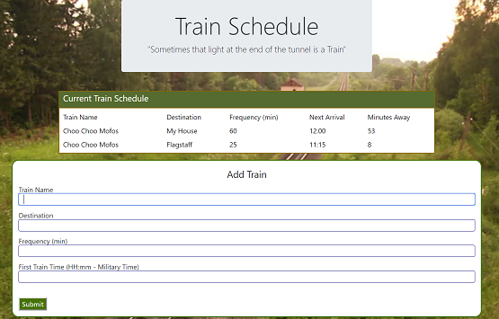

#
<h1>

Train Scheduler

</h1>
This is a dynamic webpage that allows you to create and update a train schedule.  Users can 
add train informatio and see what time the next train is expected to arrive.  This project
is useful for tracking scheduled arrival/departure times (trains/planes/buses).  To get 
started, fill out the form and click 'submit' to add train data.

---
[CLICK ME to see it in action](https://olivas1406.github.io/chooChoo/)
 
---

This project was created and is maintained by Daniel Olivas

To get help:  
me@danielolivas.net 
http://danielolivas.net
    
